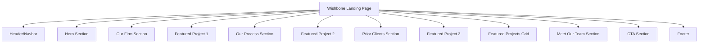

# План реализации интерфейса Wishbone Design System

## 1. Анализ существующих компонентов

### Уже реализовано:
- **WbButton** - кнопки с вариантами: primary, secondary, outline, ghost
- **WbCard** - карточки с header, content, footer
- **WbInput** - поля ввода с валидацией
- **Дизайн-система** - CSS переменные для цветов, шрифтов, отступов

### Текущая дизайн-система (style.css):
- Цветовая палитра: primary (синий), secondary (серый), success, danger, warning, info
- Шрифты: системные шрифты
- Размеры: xs, sm, base, lg, xl, 2xl, 3xl, 4xl
- Отступы: от 0.25rem до 6rem
- Радиусы: sm, md, lg, xl, full
- Тени: sm, md, lg, xl

---

## 2. Анализ Figma дизайна Wishbone

### Цветовая палитра Figma:
| Название | RGB | Hex | Использование |
|----------|-----|-----|---------------|
| Основной текст | (27, 26, 26) | #1A1A1A | Заголовки, основной текст |
| Вторичный текст | (100, 92, 85) | #645C55 | Подзаголовки, описания |
| Третичный текст | (62, 60, 53) | #3E3C35 | Мелкий текст |
| Фон страницы | (236, 232, 229) | #ECE8E5 | Основной фон |
| Белый | (255, 255, 255) | #FFFFFF | Карточки, секции |
| Светло-серый | (247, 247, 247) | #F7F7F7 | Фон секций |
| Кнопки | (27, 26, 26) | #1A1A1A | Основные кнопки |
| Граница фото | (206, 196, 189) | #CEC4BD | Рамки изображений |

### Типографика Figma:
| Размер | Вес | Использование |
|--------|-----|---------------|
| 64px | Regular | Главный заголовок Hero |
| 40px | Regular | Заголовок CTA |
| 39px | Regular | Заголовки секций |
| 32px | Regular | Подзаголовки |
| 24px | Regular | Названия проектов |
| 18px | Regular | Имена участников команды |
| 17px | Regular | Имена участников команды |
| 16px | Regular | Основной текст, кнопки |
| 15px | Regular | Навигация |
| 14px | Regular | Мелкий текст, локации |
| 13px | Regular | Ссылки в футере |

Шрифт: **Poppins**

### Отступы и размеры:
- Контейнер: 1200px
- Отступы контента: 136px (слева/справа)
- Радиусы: 12px, 14px, 64px (для аватаров)
- Высота кнопок: 46px

---

## 3. Основные секции интерфейса



### Детальное описание секций:

#### 1. Header/Navbar
- Логотип Wishbone
- Навигация: About, Projects, News, Team, Contact
- Кнопка "Get template"

#### 2. Hero Section
- Бейдж "Wishbone+Partners"
- Заголовок "The home of beautiful architecture."
- Описание (2 строки)
- Кнопка "Read more"
- Изображение справа

#### 3. Our Firm Section
- Заголовок "Our firm"
- Три параграфа текста
- Информация о Stephen Collier (Senior Partner) с фото

#### 4. Featured Project 1 (Reeding House)
- Полноэкранное изображение
- Оверлей с названием и описанием

#### 5. Our Process Section
- Бейдж "Our process"
- Заголовок "How we do what we do."
- Три карточки: Sketching, Finalizing, Building

#### 6. Featured Project 2 (The marble staircase)
- Полноэкранное изображение
- Оверлей с названием и описанием

#### 7. Prior Clients Section
- Заголовок "Happy customers."
- Бейдж "prior clients"
- Сетка логотипов клиентов

#### 8. Featured Project 3 (The swirling staircase)
- Полноэкранное изображение
- Оверлей с названием и описанием

#### 9. Featured Projects Grid
- Заголовок "Featured projects"
- Подзаголовок "Some of the latest and greatest projects..."
- Три карточки проектов:
  - Pumpkin St. Bar (Malmö)
  - Big Road Brewery (New York)
  - Lupin London (London)
- Кнопка "View all projects"

#### 10. Meet Our Team Section
- Заголовок "Meet our team"
- Описание
- Кнопка "See team"
- Сетка карточек участников:
  - Stephen Collier (Senior Partner)
  - Nolan Peters (Associate)
  - Ferris Wonder (Associate Partner)
  - Aria Stone (Senior Partner)
  - Niko Ferry (Partner)

#### 11. CTA Section
- Заголовок "Think we would be a good fit for your next project?"
- Бейдж "Get in touch"
- Кнопка "Get in touch"

#### 12. Footer
- Логотип Wishbone
- Текст "Powered by Webflow"
- Ссылки: Licensing
- Социальные иконки: Twitter, Instagram, Facebook
- Текст "All rights reserved Wishbone+Partners, Inc."

---

## 4. Новые компоненты для создания

### Базовые компоненты:
1. **WbNavbar** - навигационная панель
2. **WbLogo** - логотип Wishbone
3. **WbSection** - базовый компонент секции
4. **WbSectionHeader** - заголовок секции с бейджем
5. **WbImage** - компонент изображения
6. **WbText** - текстовый компонент
7. **WbLink** - ссылка
8. **WbBadge** - бейдж/метка

### Компоненты контента:
9. **WbHero** - главная секция
10. **WbProjectCard** - карточка проекта
11. **WbTeamCard** - карточка участника команды
12. **WbProcessCard** - карточка процесса
13. **WbClientLogo** - логотип клиента
14. **WbFeaturedProject** - полноэкранный проект с оверлеем
15. **WbCTA** - секция призыва к действию
16. **WbFooter** - подвал
17. **WbSocialIcon** - иконка социальной сети

### Компоненты макета:
18. **WbContainer** - контейнер с фиксированной шириной
19. **WbGrid** - сетка для карточек
20. **WbSpacer** - отступ между секциями

---

## 5. Порядок реализации компонентов

### Этап 1: Обновление дизайн-системы
- [ ] Обновить цветовую палитру в style.css
- [ ] Добавить шрифт Poppins
- [ ] Обновить типографические переменные
- [ ] Добавить новые размеры отступов

### Этап 2: Базовые компоненты
- [ ] WbContainer - контейнер 1200px
- [ ] WbLogo - логотип Wishbone
- [ ] WbNavbar - навигация
- [ ] WbSection - базовая секция
- [ ] WbSectionHeader - заголовок секции
- [ ] WbBadge - бейдж
- [ ] WbImage - изображение
- [ ] WbLink - ссылка
- [ ] WbSocialIcon - социальная иконка

### Этап 3: Компоненты контента
- [ ] WbHero - главная секция
- [ ] WbProcessCard - карточка процесса
- [ ] WbTeamCard - карточка участника команды
- [ ] WbProjectCard - карточка проекта
- [ ] WbFeaturedProject - полноэкранный проект
- [ ] WbClientLogo - логотип клиента
- [ ] WbCTA - секция CTA
- [ ] WbFooter - подвал

### Этап 4: Компоненты макета
- [ ] WbGrid - сетка
- [ ] WbSpacer - отступы

### Этап 5: Сборка страницы
- [ ] Обновить App.vue с новыми компонентами
- [ ] Собрать все секции в единую страницу
- [ ] Добавить адаптивность

---

## 6. Структура файлов

```
src/
├── components/
│   ├── WbButton.vue          (существует)
│   ├── WbCard.vue            (существует)
│   ├── WbInput.vue           (существует)
│   ├── WbNavbar.vue          (новый)
│   ├── WbLogo.vue            (новый)
│   ├── WbSection.vue         (новый)
│   ├── WbSectionHeader.vue   (новый)
│   ├── WbBadge.vue           (новый)
│   ├── WbImage.vue           (новый)
│   ├── WbLink.vue            (новый)
│   ├── WbSocialIcon.vue      (новый)
│   ├── WbHero.vue            (новый)
│   ├── WbProcessCard.vue     (новый)
│   ├── WbTeamCard.vue        (новый)
│   ├── WbProjectCard.vue     (новый)
│   ├── WbFeaturedProject.vue (новый)
│   ├── WbClientLogo.vue      (новый)
│   ├── WbCTA.vue             (новый)
│   ├── WbFooter.vue          (новый)
│   ├── WbContainer.vue       (новый)
│   ├── WbGrid.vue            (новый)
│   └── WbSpacer.vue          (новый)
├── composables/
│   ├── useClickOutside.js    (существует)
│   ├── useDebounce.js        (существует)
│   └── useScroll.js          (новый)
├── utils/
│   ├── validators.js         (существует)
│   └── constants.js          (новый)
├── style.css                 (обновить)
├── App.vue                   (обновить)
└── main.js                   (существует)
```

---

## 7. Спецификация компонентов

### WbNavbar
```vue
<WbNavbar
  :logo="logoData"
  :nav-items="navItems"
  :cta-button="ctaButton"
/>
```

### WbSectionHeader
```vue
<WbSectionHeader
  badge="OUR PROCESS"
  title="How we do what we do."
  description="Optional description"
/>
```

### WbHero
```vue
<WbHero
  badge="Wishbone+Partners"
  title="The home of beautiful architecture."
  description="Description text..."
  cta-text="Read more"
  :image="heroImage"
/>
```

### WbProcessCard
```vue
<WbProcessCard
  icon="sketching"
  title="Sketching"
  description="Lorem ipsum..."
/>
```

### WbTeamCard
```vue
<WbTeamCard
  :image="memberImage"
  name="Stephen Collier"
  role="Senior Partner"
/>
```

### WbProjectCard
```vue
<WbProjectCard
  :image="projectImage"
  location="Malmö"
  title="Pumpkin St. Bar"
  cta-text="Read more"
/>
```

### WbFeaturedProject
```vue
<WbFeaturedProject
  :image="projectImage"
  title="Reeding House"
  description="Lorem ipsum..."
/>
```

### WbCTA
```vue
<WbCTA
  badge="Get in touch"
  title="Think we would be a good fit for your next project?"
  cta-text="Get in touch"
/>
```

### WbFooter
```vue
<WbFooter
  :logo="logoData"
  :social-links="socialLinks"
  :links="footerLinks"
/>
```

---

## 8. Адаптивность

### Breakpoints:
- Mobile: < 768px
- Tablet: 768px - 1024px
- Desktop: > 1024px

### Адаптивные изменения:
- Navbar: гамбургер-меню на мобильных
- Hero: вертикальная компоновка на мобильных
- Grid: 1 колонка на мобильных, 2 на планшетах, 3 на десктопе
- Отступы: уменьшение на мобильных устройствах

---

## 9. Дополнительные требования

### Доступность (Accessibility):
- ARIA-атрибуты для интерактивных элементов
- Поддержка клавиатурной навигации
- Правильные контрасты цветов
- Alt-тексты для изображений

### Производительность:
- Ленивая загрузка изображений
- Оптимизация шрифтов
- CSS-анимации вместо JS

### SEO:
- Семантическая разметка HTML
- Meta-теги
- Структурированные данные

---

## 10. Следующие шаги

После утверждения плана:

1. Переключиться в режим Code для реализации
2. Начать с обновления дизайн-системы (style.css)
3. Создать базовые компоненты
4. Создать компоненты контента
5. Собрать страницу в App.vue
6. Добавить адаптивность
7. Тестирование и оптимизация
